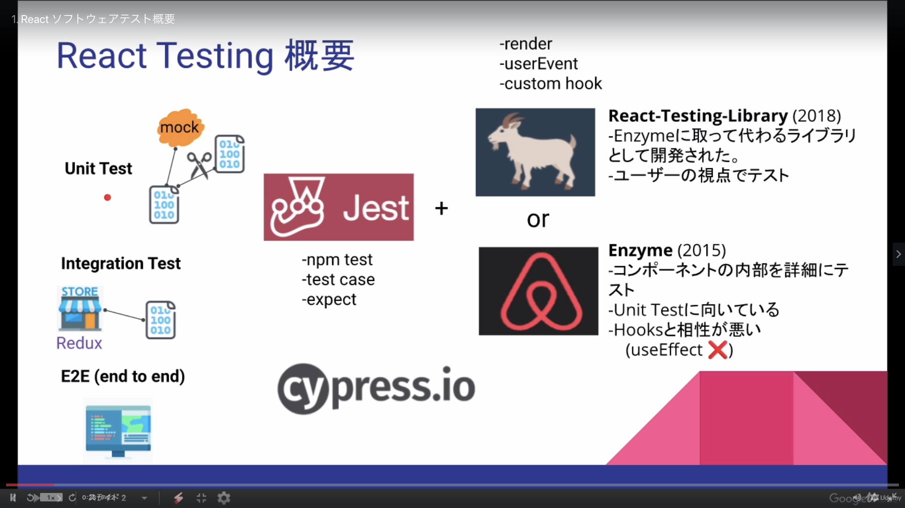

# Contents

- [Section01](#sec01)
- [Section02](#sec02)

# Section01

- Overview
  

- Tests

  - Unit Test
    - test only component
    - use mock
  - Integration Test
    - test Redux (store)
  - E2E (end to end)
    - simulate user test

- Test tools (test Unit test and Integration test)
  - Jest and React-Testing-Library (2018)
  - Jest and Enzyme (2015)

### [Return to Contents](#contents)

# Section02

- Source Code
  - [Click here](https://github.com/GomaGoma676/react-testing-library-lesson/tree/master/src)
  - [create-react-app で React + Typescript な環境を構築する](https://qiita.com/sunnyG/items/05c2e9381d6ba2d9fccf)
  - [Cannot find name ‘describe’ ~ が出たら](https://meisoudev.com/jest-on-typescript/#:~:text=Cannot%20find%20name%20'describe'%20~,%E3%82%92%E8%BF%BD%E5%8A%A0%E3%81%99%E3%82%8C%E3%81%B0OK%E3%80%82)
  - [{JSON} Placeholder](https://jsonplaceholder.typicode.com/)
- Commands
  - npx create-react-app {プロジェクト名} --template typescript
  - npm i -D eslint @typescript-eslint/parser @typescript-eslint/eslint-plugin
  - npm i -D prettier eslint-config-prettier eslint-plugin-prettier
  - npm run start
  - npm run test
- Scripts

  - "test": "react-scripts test --env=jsdom --verbose"
    - it に記載したテスト説明が出力される

- Example
  - Render
    - screen
    - expect
  - RenderInput
    - userEvent
    - jest.fn()
  - FrameworkList
    - toEqual
    - list item
  - UseEffectRender
    - axios
  - MockServer
    - setupServer
    - rest, (req, res, ctx)
  - customCounter
    - redux
    - Reducer.Test
    - ExtraReducer.Test

### [Return to Contents](#contents)
